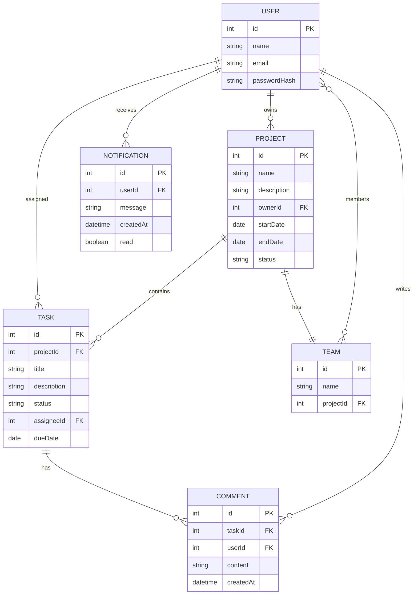

# FlowForge AI – AI-Powered Project Management Platform

## Executive Summary  
FlowForge AI is an end-to-end project management platform that leverages artificial intelligence to streamline project planning, task management, and team collaboration. Built as a modern web app (React/Tailwind frontend + Spring Boot backend + PostgreSQL), it offers real-time updates, AI-driven recommendations, and comprehensive CI/CD automation. Key features include user/project/task management, team collaboration, and AI assistants (e.g. natural-language project creation, task suggestions). The platform is designed for agile teams, offering high reliability, security (JWT/OAuth), and automated UI testing (Selenium, TestNG). 

## Project Overview  

### Description and Goals  
- **Project Goals:** Improve productivity by automating project workflows. Provide AI-powered insights (e.g. auto-generated task lists, summarizing project status) to reduce manual overhead.  
- **Key Objectives:** Support full lifecycle (project creation → planning → execution → reporting). Ensure a responsive, intuitive UI and robust backend services. Enable scalability (microservices-friendly Spring Boot, caching, containerization) and continuous delivery (Jenkins CI/CD).  
- **Success Metrics:** Faster project setup (AI-assisted), reduced manual task entry, high test coverage, and rapid iteration through CI/CD automation.

### Target Users  
- **Product Managers/Leads:** Create projects, allocate resources, track progress, generate reports.  
- **Developers/Team Members:** View/claim tasks, update status, communicate via comments/notifications.  
- **Stakeholders/Clients:** Monitor dashboards, receive automated progress summaries.  
- **DevOps/QA Engineers:** Benefit from fully automated deployment pipelines and UI testing.

## Product Requirements (PRD)

**Major Features & User Stories:**  

- **User Authentication & Profiles:**  
  - *Story:* As a **user**, I want to register/login so that I can access my projects.  
    - *Acceptance:* Secure signup/login APIs (JWT tokens), password hashing, role-based access (user/admin). Session tokens expire/invalidate on logout.  
  - *Story:* As an **admin**, I can assign roles (PM, Developer) to users.  
    - *Acceptance:* Admin UI/API to assign roles; JWT includes role claims.

- **Project Management:**  
  - *Story:* As a **project manager**, I can create/edit projects with name, description, dates, priority.  
    - *Acceptance:* POST `/api/projects` creates project; GET/PUT endpoints work; ownerId FK set; validations (name required, end date ≥ start date).  
  - *Story:* As a **manager**, I can invite team members to a project (team membership).  
    - *Acceptance:* POST `/api/projects/{id}/teams` adds users; users can belong to multiple teams.

- **Task/Issue Tracking:**  
  - *Story:* As a **user**, I can create tasks under a project, assign to myself or others, set priority/status (ToDo/InProgress/Done).  
    - *Acceptance:* POST `/api/projects/{id}/tasks` creates task; PUT changes status; tasks list returns correct assignees.  
  - *Story:* As a **user**, I receive real-time notifications when assigned a task or when a task I watch is updated.  
    - *Acceptance:* WebSocket/SSE channel delivers notifications; “read” flag stored (Notification entity).

- **AI Assistance:**  
  - *Story:* As a **user**, I can describe a project in natural language and FlowForge will generate a task list using AI.  
    - *Acceptance:* Submit prompt to `/api/ai/tasks-from-description`; backend calls LLM, returns JSON tasks; caching used for repeated prompts.  
  - *Story:* As a **manager**, I can ask for a project status summary; AI returns a concise report.  
    - *Acceptance:* Endpoint `/api/ai/summary` ingests project data and prompt, returns summary. Results should be cached if identical prompts are used.  
  - *Story:* As a **QA tester**, I can run a “What-if” simulation where AI estimates timelines given scope changes.  
    - *Acceptance:* Inputs (tasks, team size) go into `/api/ai/simulate`; LLM returns forecast (must validate numeric outputs).

- **User Stories & Acceptance Criteria:**  
  (See above scenarios. Additional user stories cover editing tasks, filtering views, generating reports, etc. All inputs are validated (OWASP best practices) and errors are handled gracefully.)  

## System Architecture  

The system uses a **React/Tailwind** single-page frontend that communicates via REST/GraphQL with a **Spring Boot** backend. The backend handles business logic and interacts with **PostgreSQL** for persistence and **Redis** for caching session/AI results. AI functions are accessed via a dedicated service/component that interfaces with external LLM APIs (e.g. OpenAI GPT) or an on-prem model. A real-time WebSocket channel supports notifications. 

The following mermaid diagram illustrates the high-level architecture and data flow:

```mermaid
flowchart LR
    A[React Frontend] -->|REST API (JSON)| B[Spring Boot API]
    B --> C[(PostgreSQL DB)]
    B --> D[(Redis Cache)]
    B --> E[AI Service (LLM Interface)]
    E --> F[OpenAI GPT-5 (Cloud)]
    A <-->|WebSocket| B
    style A fill:#d1e7fd,stroke:#333,stroke-width:1px
    style B fill:#e2f0d9,stroke:#333,stroke-width:1px
    style C fill:#fde2e2,stroke:#333,stroke-width:1px
    style D fill:#fff2cc,stroke:#333,stroke-width:1px
    style E fill:#f0f0f0,stroke:#333,stroke-width:1px
    style F fill:#fce8dd,stroke:#333,stroke-width:1px
```

- **Frontend (React):** Follows modern best practices: feature-based folder structure, co-locating CSS/JS/tests as recommended. Components manage state with Redux/Context or React Query; Tailwind CSS for styling.  
- **Backend (Spring Boot):** Single (or micro-)service with layered architecture: controllers, services, repositories. The main `@SpringBootApplication` class is placed at the root package to enable component scanning. Code is organized by feature (e.g. `com.flowforge.project`, `com.flowforge.task`).  
- **Database (PostgreSQL):** Robust relational store for core data. Use UUID or BIGINT keys as recommended, and connection pooling (e.g. HikariCP, PgBouncer) for efficiency. All sensitive config (credentials, URLs) are stored in environment variables (12-factor app).  
- **Cache (Redis):** Stores session tokens, AI prompt results, and other transient data to reduce DB/API calls. For example, AI-generated task lists or summaries are cached to improve response times.  
- **AI Service:** Manages LLM calls. Implements prompt templates and engineering (few-shot examples) for consistent outputs. Coordinates API usage (possibly batching requests or using streaming) for efficiency. Maintains a vector database (e.g. Pinecone, Redis Vector) for retrieval-augmented generation as needed. Follows best practices: prompt caching to save on latency/cost, and always handles API rate limits per OpenAI guidelines.  

**Technology Choices Comparison:**  

| Layer         | Options Considered                | Decision & Rationale (with references) |
|---------------|-----------------------------------|---------------------------------------|
| **Frontend**  | React (selected), Angular, Vue    | React offers a rich ecosystem and flexible component model. Official docs recommend organizing code by feature. Tailwind accelerates styling. |
| **Backend**   | Spring Boot (selected), Node/Express, Django  | Spring Boot provides a mature Java stack, integrated security, JPA, and easy REST/API creation. It aligns well with enterprise needs. |
| **Database**  | PostgreSQL (selected), MySQL, MongoDB       | PostgreSQL is reliable and feature-rich (JSON support, full-text search). Best practices like storing credentials via env variables and using UUID/BIGINT are documented. |
| **CI/CD**     | Jenkins (selected), GitHub Actions, GitLab CI | Jenkins pipelines are widely used and support complex workflows. It can run tests, build images, and deploy. Declarative syntax (`pipeline { ... }`) is well-documented. |
| **Testing**   | Selenium WebDriver (selected), Cypress, Playwright | Selenium supports Java/TestNG stack and cross-browser grid. It has mature integration for CI/CD. Best practices (stable locators, POM) reduce flakiness. |
| **Containerization** | Docker/Docker Compose (selected), Kubernetes | Docker and Compose simplify local dev and multi-service orchestration. We use multi-stage Dockerfiles (Node→Nginx for React) and Compose to run DB, app, cache, and Selenium Grid together. Kubernetes could be added for scale if needed. |

## Data Model

Key entities include **User**, **Project**, **Task**, **Comment**, **Team**, and **Notification**. Below is a simplified Entity-Relationship diagram of the main tables:



- **Relationships:** A `USER` *owns* many `PROJECT`s (`ownerId`), a `PROJECT` *contains* many `TASK`s, each `TASK` can have many `COMMENT`s, and users can belong to many `TEAM`s (project-based teams). Notifications are per-user. We enforce foreign keys for referential integrity.  
- **Attributes:** We use UUIDs or INT PKs (PK), and include timestamp fields (createdAt) for auditing. All user inputs (text fields, IDs) are validated against schemas/rules to prevent injection (OWASP recommends strict validation with allowlists).  

## API Design

The backend exposes a RESTful API (JSON over HTTPS). Example endpoints:

- **Authentication:**  
  - `POST /api/auth/register` – Create user account.  
  - `POST /api/auth/login` – Authenticate (email/password) and return JWT.  
- **Users:**  
  - `GET /api/users/{id}` – Get user profile (auth required).  
- **Projects:**  
  - `GET /api/projects` – List projects (user-specific or all if admin).  
  - `POST /api/projects` – Create project.  
  - `GET /api/projects/{id}` – Project details.  
  - `PUT /api/projects/{id}` – Update project.  
- **Tasks:**  
  - `GET /api/projects/{id}/tasks` – List tasks in a project.  
  - `POST /api/projects/{id}/tasks` – Create task (requires `title`, `assigneeId`).  
  - `PUT /api/tasks/{taskId}` – Update a task (status changes, reassign).  
- **AI:**  
  - `POST /api/ai/tasks-from-description` – Request auto-generated tasks (body: projectId + description).  
  - `POST /api/ai/summary` – Request project summary.  

Each endpoint returns JSON and appropriate HTTP codes. Use pagination for lists. Example: 

| Method | Endpoint                    | Description                              | Sample Request Body                 | Sample Response                            |
|--------|-----------------------------|------------------------------------------|-------------------------------------|--------------------------------------------|
| POST   | `/api/auth/login`           | Authenticate user                        | `{ "email": "...", "password": "..."}` | `{ "token": "eyJhb...", "user": {id, name} }` |
| GET    | `/api/projects/42`          | Get project details                      | —                                   | `{ "id":42, "name":"X", "status":"Active", ...}` |
| POST   | `/api/projects`             | Create a new project                     | `{ "name": "NewProj", "description": "...", "startDate": "2026-07-01" }` | `{ "id": 123, "name":"NewProj", ... }` |
| POST   | `/api/projects/123/tasks`   | Create a task in project 123            | `{ "title": "Setup DB", "assigneeId": 5, "dueDate":"2026-07-10" }` | `{ "id": 987, "title":"Setup DB", ... }` |
| POST   | `/api/ai/tasks-from-description` | Generate tasks via AI               | `{ "projectId":123, "description":"Build login page with validation" }` | `{ "tasks":[{"title":"Create login form"},...] }` |

Authentication is required on most endpoints. We use JWTs in an `Authorization: Bearer ...` header, per best practices. Input fields are rigorously validated (see Security).

## AI Integration Patterns

FlowForge AI uses Large Language Models (LLMs) to enhance features. Key patterns include:

- **Prompt Engineering:** We create reusable prompt templates (system/user messages) to maintain consistency. For example, a system prompt “You are FlowForge AI...” ensures focused behavior. We position static instructions first to leverage prompt caching benefits.  
- **LLM Orchestration:** Complex workflows may involve multiple LLM calls (e.g., one for understanding user query, another for generating structured output). We design these as orchestrated pipelines. This follows emerging best practices for multi-agent AI workflows. Frameworks like LangChain or Orq.ai could be used to manage chains, retries, and format conversions.  
- **Caching & Rate-Limits:** Frequently repeated prompts or overlapping context (like tool lists) are cached to reduce latency/cost. We ensure static context (instructions/examples) appears at the prompt start. API rate limits are respected: we implement back-off or request queuing as OpenAI advises.  
- **Vector DB (Optional):** For advanced features (long-term memory, semantic search), a vector database (Pinecone, Weaviate, Redis) can index embeddings of project descriptions or documents. This lets the AI retrieve relevant context efficiently when generating replies.  
- **Security in AI:** API keys for OpenAI are kept in secured environment variables, never in code. We also validate all AI inputs/outputs (e.g. numeric estimates) to prevent injection.

## Security Considerations

- **Authentication:** Use **JWT** for stateless auth. Tokens are signed with a strong secret and short-lived. Use HTTPS and store secrets (JWT signing keys, OAuth client secrets) in secure vault/env variables.  
- **Authorization (OAuth2):** For integrations (e.g. Google SSO, Jira link), implement OAuth2 flows. The Spring Security framework can manage this with clear OAuth2 roles and scopes.  
- **Input Validation:** All external inputs (API parameters, form fields) are strictly validated. Follow OWASP’s recommendation: apply both syntactic (format/type) and semantic (business rule) validation as early as possible. Use allowlists/patterns (e.g. email regex) and framework validators (Spring’s `@Valid`, Hibernate Validator, etc). Reject malformed data before processing.  
- **Logging & Monitoring:** Avoid logging sensitive data (passwords, tokens). Audit failed logins and significant actions.  
- **API Security:** Implement CSRF protection on forms, set secure cookies if used, and use Content Security Policy (CSP) headers on front-end.  
- **Dependency Security:** Keep libraries up to date. For example, use latest stable Selenium/Spring Boot/WebDriverManager versions to avoid known CVEs.  
- **Network Security:** In production, run components in private subnets or VPCs. Expose only necessary ports (80/443 for web, 5432 to backend only). Use OAuth scopes/roles to limit API access.

## Testing and Automation

We adopt a robust UI automation strategy (Java + Selenium WebDriver + TestNG + Maven). Best practices include: 
- **Page Object Model (POM):** Encapsulate page interactions in reusable classes for maintainability.  
- **WebDriverManager:** Use [WebDriverManager](https://bonigarcia.dev/webdrivermanager/) to automatically handle browser driver binaries. This avoids manual `chromedriver` installs.  
- **Maven Project Setup:** The `pom.xml` includes dependencies for Selenium (`selenium-java`), TestNG, WebDriverManager, and a logging framework (SLF4J). Example Maven snippet:

  ```xml
  <dependencies>
    <!-- Selenium WebDriver -->
    <dependency>
      <groupId>org.seleniumhq.selenium</groupId>
      <artifactId>selenium-java</artifactId>
      <version>4.6.0</version>
    </dependency>
    <!-- TestNG for test framework -->
    <dependency>
      <groupId>org.testng</groupId>
      <artifactId>testng</artifactId>
      <version>7.4.0</version>
      <scope>test</scope>
    </dependency>
    <!-- WebDriverManager for driver binaries -->
    <dependency>
      <groupId>io.github.bonigarcia</groupId>
      <artifactId>webdrivermanager</artifactId>
      <version>5.3.2</version>
    </dependency>
  </dependencies>
  ```
  (These values can be updated to the latest stable releases.)  

- **TestNG Configuration:** The `testng.xml` suite file defines parallel execution. For instance, to run tests in parallel across classes:

  ```xml
  <!DOCTYPE suite SYSTEM "https://testng.org/testng-1.0.dtd">
  <suite name="FlowForge Suite" parallel="classes" thread-count="4">
    <test name="UI Tests">
      <classes>
        <class name="com.flowforge.tests.LoginTests"/>
        <class name="com.flowforge.tests.ProjectTests"/>
        <class name="com.flowforge.tests.TaskTests"/>
      </classes>
    </test>
  </suite>
  ```
  Here `parallel="classes"` lets TestNG run different test classes concurrently.

- **Reporting:** Integrate [Extent Reports](https://extentreports.com/) or Allure for HTML test reports. Attach screenshots on failures. According to best practices, capture detailed logs and screenshots.  
- **Parallel & Cross-Browser:** Use Selenium Grid (hosted via Docker Compose) to run Chrome/Firefox/Edge tests in parallel. This speeds execution.  
- **Maven Surefire:** Configure the Maven Surefire plugin to execute tests and generate JUnit XML outputs for Jenkins. Ensure `<parallel>` and `<threadCount>` (if using TestNG) are set in Surefire. This allows the Jenkins HTML Publisher plugin to aggregate results.

## Continuous Integration and Deployment (CI/CD)

We use **Jenkins** for CI/CD pipelines, as code (`Jenkinsfile`). Key steps:

- **Pipeline Stages:** Checkout → Build → Test → Docker Build → Push → Deploy. Example Declarative pipeline snippet:

  ```groovy
  pipeline {
    agent any
    tools {
      maven 'Maven_3.8.4'
      jdk 'OpenJDK_17'
    }
    stages {
      stage('Checkout') {
        steps { checkout scm }
      }
      stage('Build & Test') {
        steps {
          sh 'mvn clean test'
        }
      }
      stage('Docker Build') {
        steps {
          sh 'docker build -t flowforge-frontend:latest ./frontend'
          sh 'docker build -t flowforge-backend:latest ./backend'
        }
      }
      stage('Publish Reports') {
        steps {
          publishHTML([reportDir: 'target/surefire-reports', reportFiles: 'index.html', reportName: 'Test Report'])
        }
      }
    }
  }
  ```
  This shows `agent any`, `tools` for Maven/JDK configuration, and stages with shell commands. We use **parallel** stages if building frontend/backend separately. For example, Jenkins can parallelize:
  ```groovy
  parallel {
    stage('Build Frontend') { steps { /*npm build*/ } }
    stage('Build Backend')  { steps { /*mvn package*/ } }
  }
  ```
  (TestMu example shows using `parallel` blocks and labeling agents.)

- **Agent Configuration:** Jenkins Global Tool Configuration specifies Maven and JDK installations referenced by name in `tools`. The pipeline itself auto-checkouts code (no need for explicit `checkout scm` in Declarative).  
- **Environment Variables:** Pipeline uses Jenkins credentials for secrets. E.g., store Docker registry credentials or API keys.  
- **Docker Compose & Selenium Grid:** Our `docker-compose.yml` (development) brings up the backend, frontend, PostgreSQL, Redis, and Selenium Grid (Hub + browser nodes). For example:

  ```yaml
  version: '3.8'
  services:
    backend:
      build: ./backend
      ports: ["8080:8080"]
      environment:
        SPRING_PROFILES_ACTIVE: prod
      depends_on:
        - db
        - redis
    frontend:
      build: ./frontend
      ports: ["3000:80"]
      depends_on:
        - backend
    db:
      image: postgres:15
      environment:
        POSTGRES_USER: flowforge
        POSTGRES_PASSWORD: changeme
      volumes:
        - db-data:/var/lib/postgresql/data
    redis:
      image: redis:7-alpine
    selenium-hub:
      image: selenium/hub:4.9.1-20230920
      ports: ["4444:4444"]
    chrome:
      image: selenium/node-chrome:4.9.1-20230920
      depends_on: [selenium-hub]
      environment:
        - SE_EVENT_BUS_HOST=selenium-hub
    firefox:
      image: selenium/node-firefox:4.9.1-20230920
      depends_on: [selenium-hub]
      environment:
        - SE_EVENT_BUS_HOST=selenium-hub
  volumes:
    db-data:
  ```
  This is inspired by Dockerized Selenium Grid patterns. The Jenkinsfile can launch `docker-compose up -d` to spin up the grid before tests. Running Grid via Docker is a recommended way to scale cross-browser testing.  

- **Jenkins Plugins:** Install HTML Publisher (for test reports) and any Docker plugins if needed. Store the Jenkinsfile in source control (as in Git). Use Webhooks or multibranch pipelines to trigger builds on commit.  

## Deployment & Infrastructure

- **Containers:** We provide Dockerfiles for frontend and backend. *Frontend Dockerfile* uses a multi-stage build (Node → Nginx) as per Docker’s official guide. *Backend Dockerfile* is a simple Java build:  
  ```dockerfile
  FROM eclipse-temurin:17-jdk-alpine
  WORKDIR /app
  COPY target/flowforge-backend.jar /app/app.jar
  ENTRYPOINT ["java","-jar","app.jar"]
  ```
- **Docker Compose:** For local or simple deployments, use the `docker-compose.yml` above. For production, images are pushed to a registry and deployments are automated (via Kubernetes or Compose in a cloud VM).  
- **Deployment Steps:**  
  1. **Build:** Run `mvn clean package` for backend, `npm run build` for frontend.  
  2. **Test:** Automated tests via Jenkins.  
  3. **Containerize:** Build Docker images (`docker build`).  
  4. **Deploy:** Pull images on server or push to registry. Start services with Compose or K8s. Use environment-specific configs (e.g. PROD vs DEV profiles).  
- **Migrations:** Use Flyway/Liquibase for DB schema changes. CI pipeline can run migrations on startup.  
- **SSL/HTTPS:** In production, front the app with Nginx or a load balancer providing TLS certificates.  

## Monitoring, Logging, and Performance

- **Logging:** Backend logs (via Logback/SLF4J) should be structured (JSON) and sent to a logging system (ELK/CloudWatch). Frontend errors can be captured with a service (e.g. Sentry).  
- **Metrics:** Expose health checks and metrics (Spring Actuator) for CPU/memory and custom metrics (request durations). Use Prometheus/Grafana or cloud monitoring to track them.  
- **Performance:**  
  - **Caching:** Besides Redis, cache static AI responses. OpenAI best practices highlight caching to improve response times.  
  - **Horizontal Scaling:** Design stateless services so we can run multiple backend instances behind a load balancer. Use Docker images on a Kubernetes cluster or multiple VM instances.  
  - **DB Indexing:** Index foreign keys and frequently queried columns (e.g. task status) for efficiency.  
  - **LLM Optimization:** Use smaller models for routine tasks to reduce latency/cost (as OpenAI suggests using models like `gpt-5.4-mini` for faster responses when possible). Consider streaming or batching requests to reduce latency for large outputs.  
  - **Front-end:** Lazy-load heavy components, use code splitting.  

## Development Timeline

An example phased timeline (12 weeks):

1. **Weeks 1–2 (Setup & Core Features):** Define requirements and user stories; set up project repos (frontend/backend). Implement user auth and project entities (CRUD) with basic UI forms.  
2. **Weeks 3–4 (Task Management & Teams):** Build task CRUD, team membership, and commenting. Establish database schema and entity relationships.  
3. **Weeks 5–6 (AI Integration Prototype):** Integrate LLM APIs for task generation and summary. Create prompt templates. Set up vector DB (if applicable).  
4. **Weeks 7–8 (UI/UX & Real-Time):** Enhance frontend UX, add WebSocket notifications. Implement responsive layouts with Tailwind.  
5. **Weeks 9–10 (Testing & CI/CD):** Develop Selenium/TestNG suites (POM, parallel tests). Set up Jenkins pipeline, Dockerfiles, and Docker Compose. Automated builds and deployments.  
6. **Weeks 11–12 (Security & Optimization):** Perform security review (OWASP), input validation, JWT/OAuth flows. Add performance tuning (caching, index creation). Prepare documentation and final polish.  

Each phase concludes with code review and demo. This timeline is illustrative; actual durations may vary based on team size and scope.

*All components and code are to be documented, version-controlled, and containerized. Key configuration files (Jenkinsfile, Dockerfile, docker-compose.yml, etc.) are maintained in the repo root.*  

